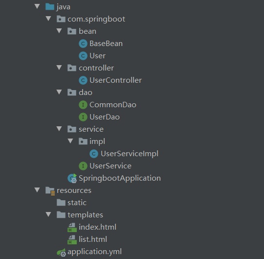

# SpringBoot

## 项目结构

- bean层：持久化层
- dao层：数据访问层
- service层：业务逻辑层（该层由Service接口和其实现类组成）。
- controller层：控制层



## pom.xml添加依赖

```xml
<!-- Spingboot相关jar包版本 -->
<parent>
<groupId>org.springframework.boot</groupId>
<artifactId>spring-boot-starter-parent</artifactId>
<version>2.3.1.RELEASE</version>
</parent>
<!-- 相关jar包 -->
<dependencies>
    <!-- Springboot核心jar包 -->
    <dependency>
        <groupId>org.springframework.boot</groupId>
        <artifactId>spring-boot-starter</artifactId>
    </dependency>
    <!-- web开发包：包含Tomcat和Springmvc -->
    <dependency>
        <groupId>org.springframework.boot</groupId>
        <artifactId>spring-boot-starter-web</artifactId>
    </dependency>
    <!-- Junit测试jar包 -->
    <dependency>
        <groupId>junit</groupId>
        <artifactId>junit</artifactId>
        <scope>test</scope>
    </dependency>
    <!-- spring-boot热部署 -->
    <dependency>
        <groupId>org.springframework.boot</groupId>
        <artifactId>spring-boot-devtools</artifactId>
    </dependency>
    <!-- thymeleaf -->
    <dependency>
        <groupId>org.springframework.boot</groupId>
        <artifactId>spring-boot-starter-thymeleaf</artifactId>
    </dependency>
    <!-- jdbc链接容器 -->
    <dependency>
        <groupId>mysql</groupId>
        <artifactId>mysql-connector-java</artifactId>
    </dependency>
    <!-- jpa（已包含hibernate） -->
    <dependency>
        <groupId>org.springframework.boot</groupId>
        <artifactId>spring-boot-starter-data-jpa</artifactId>
    </dependency>
</dependencies>
```

## application.yml配置

```yml
#服务器配置
server:
  port: 8080
  session-timeout: 30
  tomcat.max-threads: 0
  tomcat.uri-encoding: UTF-8

#spring相关配置
spring:
  #配置thymeleaf（这样配置后，再代码中返回到那个页面就不用写过多的前缀和后缀了，达到简化效果）
  thymeleaf:
    prefix: classpath:/templates/
    suffix: .html
    mode: HTML5
    encoding: UTF-8
    content-type: text/html
    cache: false
  #配置数据库相关信息
  datasource:
    #java.sql.sql异常：服务器时区值。在配置数据库的urlserverTimezone=GMT%2B8
    url: jdbc:mysql://localhost:3306/boot?serverTimezone=GMT%2B8&useUnicode=true&characterEncoding=UTF-8
    driver-class-name: com.mysql.cj.jdbc.Driver
    username: root
    password: 123456
    initial-size: 10
    max-active: 20
    max-idle: 8
    min-idle: 8
  #配置jpa（hibernate）相关信息
  jpa:
    database: mysql
    show-sql: true
    hibernate:
      ddl-auto: update
      naming:
        physical-strategy: org.springframework.boot.orm.jpa.hibernate.SpringPhysicalNamingStrategy
    database-platform: org.hibernate.dialect.MySQL5InnoDBDialect

```

## bean层

### BaseBean类

```java
//用来标识父类
@MappedSuperclass
public class BaseBean {

    /**
     * 自增长ID
     */
    @Id     //声明一个实体类的属性映射为数据库的主键列
    @GeneratedValue(strategy = GenerationType.IDENTITY) //标注主键的生成策略,IDENTITY：采用数据库ID自增长的方式来自增主键字段
    private Long id;
}
```

### User类

```java
@Entity     //表明该类 (UserEntity) 为一个实体类
@Table(name = "user")   //指明数据库的表名
public class User extends BaseBean {
    private String name;
    private int age;
    private String info;
    public String getName() {
        return name;
    }
    public void setName(String name) {
        this.name = name;
    }
    public int getAge() {
        return age;
    }
    public void setAge(int age) {
        this.age = age;
    }
    public String getInfo() {
        return info;
    }
    public void setInfo(String info) {
        this.info = info;
    }
}
```

## DAO层

### CommonDao接口

```java
@Repository
public interface CommonDao<T extends BaseBean> extends JpaRepository<T, Long> {

}
```

### UserDao接口

```java
//数据访问层
@Repository
public interface UserDao extends CommonDao<User> {
    List<User> findByName(String name);
}
```

## Service层

### Service接口

```java
public interface UserService {

    /**
     * 保存用户对象
     * @param user
     */
    void save(User user);
    /**
     * 获取所有用户对象
     * @return
     */
    List<User> getUserList();
    /**
     * 删除所有用户
     * @return
     */
    void delAllUser();
    /**
     * 通过名字获取用户(列表)
     * @return
     */
    List<User> getUser(String name);
}
```

### ServiceImpl实现类

```java
//业务逻辑层
@Service
public class UserServiceImpl implements UserService {
    @Autowired
    private UserDao userDao;
    @Override
    public void save(User user) {
        userDao.save(user);
    }
    @Override
    public List<User> getUserList() {
        return userDao.findAll();
    }
    @Override
    public void delAllUser(){
        userDao.deleteAll();
    }
    @Override
    public List<User> getUser(String name){
        return userDao.findByName(name);
    }
}
```

## Controller层

```java
//页面控制层
@Controller
public class UserController {
    @Autowired  //属性装配
    private UserService userService;
    @RequestMapping("/hello")
    @ResponseBody
    public String hello() {
        return "Hello World !!!";
    }
    @RequestMapping("/index")
    public String index(Model model) {
        model.addAttribute("name", "jack");
        model.addAttribute("age", 20);
        model.addAttribute("info", "我是一个爱学习的好青年");
        return "index";
    }
    @RequestMapping("/save")
    @ResponseBody
    public String save(User user) {
        userService.save(user);
        return "save success !";
    }
    @RequestMapping("/deleteAll")
    @ResponseBody
    public String deleteAll(User user) {
        userService.delAllUser();
        return "delete success !";
    }
    @RequestMapping("/userList")
    public String userList(Model model) {
        List<User> userList = userService.getUserList();
        model.addAttribute("userList", userList);
        return "list";
    }
    @RequestMapping("/getUser")
    @ResponseBody
    public List<User> getUser(){
        List<User> users = userService.getUser("Tom");
        return users;
    }
}
```